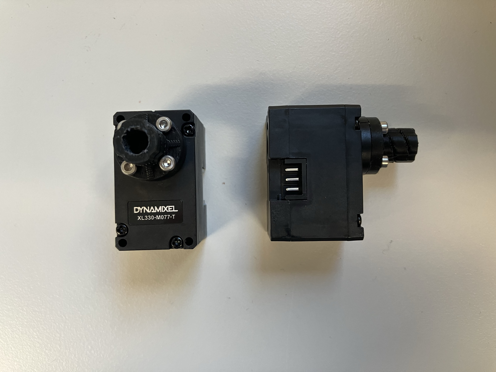
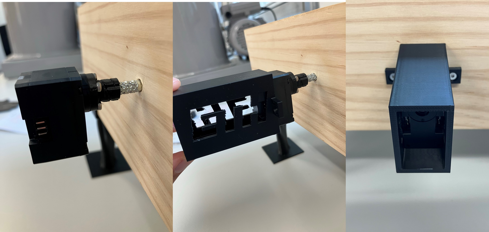
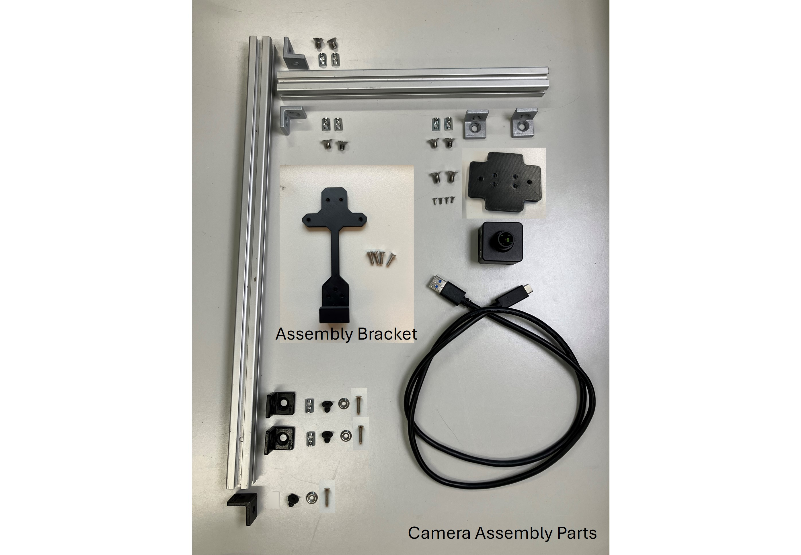

Hardware Setup
=====

## List of Components

### Labyrinth
* 1x [BRIO Labyrinth](https://www.brio.us/en-US/products/games/labyrinth-game-63400000) (wooden version)

### XL330-M077-T Motors
* 2x [ROBOTIS Dynamixel XL330-M077-T](https://www.robotis.us/dynamixel-xl330-m077-t/)
* 1x [ROBOTIS Dynamixel Starter Set](https://www.robotis.us/dynamixel-starter-set-us/) (select the correct US/INTL version)
* 3x wires to extend cable to reach between both motors
* 2x [Motor couplings](https://github.com/ckoethz/cyberrunner_docs_md/blob/main/assets/brio_coupler.stp) (to 3d print)
    Note: These couplings are designed to break after being coupled to the motor. We recommend to print 2x extra.
* 2x [Motor mounting brackets](https://github.com/ckoethz/cyberrunner_docs_md/blob/main/assets/brio_motor_l.stp) (to 3d print)
* 8x M2x6 B610 bolts fix couplers to the motors (included with motors)
* 8x M2x16 B610 bolts to hold motor into the bracket
* 4x wood screws to mount bracket to the labyrinth (size)
* 4x plastic washers to space bracket from labyrinth

### MX-12W Motors
* 2x [ROBOTIS Dynamixel MX-12W Motors](https://www.robotis.us/dynamixel-mx-12w/)
* 1x [ROBOTIS Dynamixel Starter Set](https://www.robotis.us/dynamixel-starter-set-us/) (select the correct US/INTL version)
* 3x wires to extend cable to reach between both motors
* 2x [Motor couplings](https://github.com/ckoethz/cyberrunner_docs_md/blob/main/assets/brio_coupler.stp) (to 3d print)
* 2x [Motor mounting brackets](https://github.com/ckoethz/cyberrunner_docs_md/blob/main/assets/brio_motor_l.stp) (to 3d print)
* 8x M2x6 B610 bolts fix couplers to the motors (included with motors)
* 8x M2x8 B610 bolts to hold motor into the bracket (included with motors)
* 4x wood screws to mount bracket to the labyrinth (size)
* 4x plastic washers to space bracket from labyrinth

!!! disclaimer

    The Dynamixel MX-12W motors have been discontinued. 

### Camera
* 1x [See3CAM_24CUG USB3 Camera](https://www.e-consystems.com/industrial-cameras/ar0234-usb3-global-shutter-camera.asp#) (with enclosure)
* 1x Camera mounting plate (https://github.com/ckoethz/cyberrunner_docs_md/blob/main/assets/camera_mounting_plate.STEP)
* 4x M2x6 BN4719 bolts to attach the camera to the mounting plate
* 2x 2020 T-slotted Aluminum with lengths of 40 cm and 20 cm
* 7x L-brackets for T-slotted aluminum, size M5
* 9x T-slot nuts, size M5
* 9x T-slot bolts, size M5x8
* 2x T-slot bolts to mount the camera, size M5x10
* 3x wood screws to mount the camera scaffolding (size)
* 3x washers for wood screws as appropriate. 

### Miscellaneous
* 8x [Dark blue circle labels](https://www.herma.co.uk/office-home/product/colour-dots-small-pack-1833/) (8mm diameter)

## Building CyberRunner

###  XL330-M077-T Motors

1. Carefully remove the two knobs from the labyrinth by using a flathead screwdriver and pressing the knobs away from the labyrinth board. Slightly heating the knobs with a heat gun or a hairdryer will facilitate this process.  
  

2. Mount the motor couplers to the front of the motors using the M2x6 bolts included with the motors.  
  

3. Press fit the motors into the 3D-printed housings. This step is expected to take some effort.  
  

4. Secure the motors into the housings with the M2x16 bolts.  

5. Press both motor couplers over the labyrinth shafts. You may need to slightly heat the couplers with a heat gun or hairdryer. Then, fix the motors to the labyrinth by using the M2x10 wood screws.  
  

###  MX-12W Motors

!!! disclaimer

    The Dynamixel MX-12W motors have been discontinued. Instructions for the Dynamizel XL330-M077-T motors are above.

1. Carefully remove the two knobs from the labyrinth by using a flathead screwdriver and pressing the knobs away from the labyrinth board. Slightly heating the knobs with a heat gun or a hairdryer will facilitate this process.  
  

2. Mount the motor couplers to the front of the motors using the M2x6 bolts included with the motors.  
  

3. Insert the included nuts on the underside of the motors.  
  

4. Mount the included mounting frames of the motors to the 3d-printed mounting brackets using the included M2x6 bolts and nuts.  
  

5. Attach the motors to the mounting frames using the included M2x6 bolts.  
  

6. Press both motor couplers over the labyrinth shafts. You may need to slightly heat the couplers with a heat gun or hairdryer. Then, fix the motors to the labyrinth by using the M2.5x10 wood screws.  
  

### Camera

The camera has to be have a stable view of the whole labyrinth. This can be done with a scaffolding made with 2020 T-slotted Aluminum and a custom camera mounting plate as described below.

{.center .medium}

1. Mount the camera to the mounting plate and assmble the aluminum profiles as shown in the picture below.  
  

2. Mount the assembly to the labyrinth board using wood screws and appropriate washers. If done correctly, the camera should be centered over the labyrinth board. Additionally, the distance between the bottom of the lens and the labyrinth playing surface should be approximately 25cm.  

!!! Warning

    Ensure that the wood screws do not interfere with the motion of the labyrinth playing surface!

### Calibration Markers

In the next step, we place blue markers on the labyrinth. These are used to estimate the inclination angles of the labyrinth playing surface.

1. Place the first four blue labels on the centers of the corners of the labyrinth playing surface. The diameter of the labels and the width of the edge are both 8mm, and thus the labels should align with the outer edges. Place the next four blue labels on ... TODO.

### Cabling

1. Clip the ends of 2 ROBOT X3P cables. Place extra wire between the corresponding pins and solder the connections. Apply heat shrink over the connections for protection.
{.center .large}  

2. Connect the motors together with the extended ROBOT X3P cable. Connect the motor opposite of the camera scaffolding to the U2D2 with the ROBOT X3P cable from the Starter Kit. Connect the U2D2 to the Power Hub with another ROBOT X3P cable. See the [U2D2 Power Hub Manual](https://emanual.robotis.com/docs/en/parts/interface/u2d2_power_hub/) for more information.  

3. The U2D2 communicates the computed actions from the computer to the motors. These can now be connected with the USB Micro-B cable included in the Starter Kit.  

4. Connect the included USB cable with the camera to the computer.  

4. To power the motors, plug in the included 5V Power Supply from the Starter Kit and connect it to the Power Hub.  

5. OPTIONAL: Use the included rivets and supports to secure the U2D2 and Power Hub to the side or bottom of the labyrinth. Additionally, secure the cables with zip ties and zip tie mounts, if desired.  
