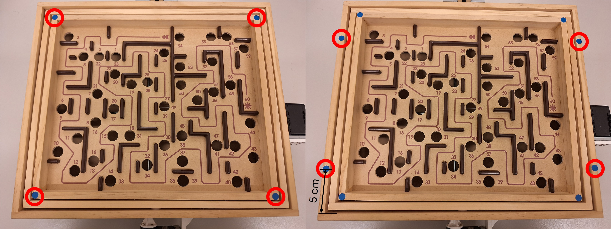

Hardware Setup
=====

## List of Components

### Labyrinth
* 1x [BRIO Labyrinth](https://www.brio.us/en-US/products/games/labyrinth-game-63400000) (wooden version)

### Motors
* 2x [ROBOTIS Dynamixel MX-12W](https://www.robotis.us/dynamixel-mx-12w/)
* 1x [ROBOTIS Dynamixel Starter Set](https://www.robotis.us/dynamixel-starter-set-us/) (select the correct US/INTL version)
* 2x [Motor couplings](../assets/brio_coupler.stp) (to 3d print)
* 2x [Motor mounting brackets](../assets/brio_motor_l.stp) (to 3d print)
* 8x M2.5x10 wood screws

**Disclaimer**: The Dynamixel MX-12W motors have been discontinued. Instructions using a suitable replacement will follow with the next release.

### Camera
* 1x [See3CAM_24CUG USB3 Camera](https://www.e-consystems.com/industrial-cameras/ar0234-usb3-global-shutter-camera.asp#) (with enclosure)
* 2x Aluminum T-slot profiles (TODO lengths)
* TODO: screws etc.
* 1x Camera mounting plate (TODO drawing)

### Miscellaneous
* 8x [Dark blue circle labels](https://www.herma.co.uk/office-home/product/colour-dots-small-pack-1833/) (8mm diameter)

## Building CyberRunner

### Motors

1. Carefully remove the two knobs from the labyrinth by using a flathead screwdriver and pressing the knobs away from the labyrinth board. Slightly heating the knobs with a heat gun or a hairdryer will facilitate this process.

2. Mount the motor couplers to the front of the motors using the M2x6 bolts included with the motors.

3. Insert the included nuts on the underside of the motors.

4. Mount the included mounting frames of the motors to the 3d-printed mounting brackets using the included M2x6 bolts and nuts.

5. Attach the motors to the mounting frames using the included M2x6 bolts.

6. Press both motor couplers over the labyrinth shafts. You may need to slightly heat the couplers with a heat gun or hairdryer. Then, fix the motors to the labyrinth by using the M2.5x10 wood screws.

### Camera

1. Mount the camera to the mounting palte and assmble the aluminum profiles as shown in the picture below.

2. Mount the assembly to the labyrinth board using wood screws. If done correctly, the camera should be centered over the labyrinth board. Additionally, the distance between the bottom of the lens and the labyrinth playing surface should be approximately 25cm.

### Calibration Markers

In the next step, we place blue markers on the labyrinth. These are used to estimate the inclination angles of the labyrinth playing surface.
1. Place the first four blue labels on the centers of the corners of the labyrinth playing surface. The diameter of the labels and the width of the edge are both 8mm, and thus the labels should align with the outer edges. Place the next four blue labels on ... TODO.

### Cabling

TODO