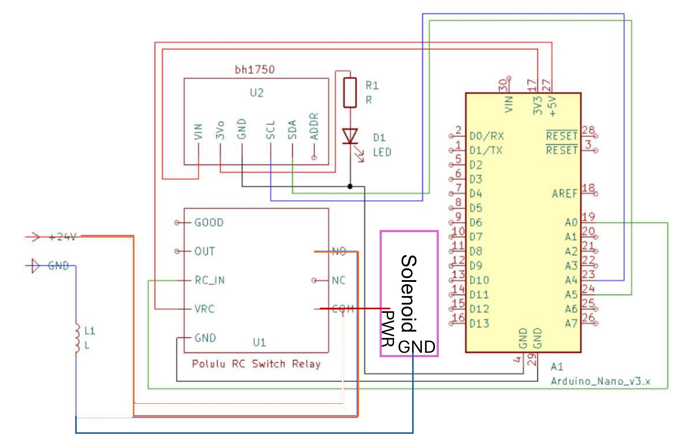
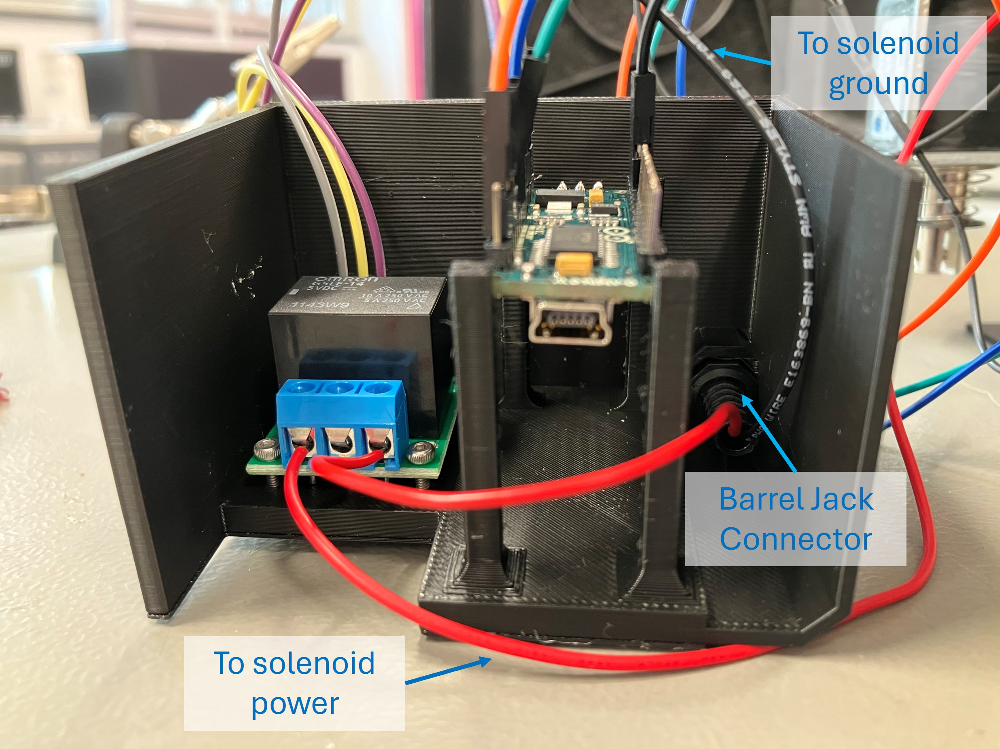

Reload Mechanism
=====

!!! note

    This page is a work in progress.

> Below are the instructions to add an automatic reload mechanism to the CyberRunner robot. The reload mechanism uses a light sensor to detect when the marble is ready to be reset to the beginning. A solenoid then launches the ball through a tube path back to the start.

## Tools
* Toolkit with Allen wrenches and screwdrivers
* Soldering iron
* Wire clippers and strippers
* Hot glue gun
* Heat gun or hair dryer
* Pliers

## List of Purchased Components
* 1x <a href="https://www.adafruit.com/product/413" target="_blank">Adafruit Large Push-Pull Solenoid</a> 
* 1x <a href="https://store.arduino.cc/products/arduino-nano" target="_blank">Arduino Nano</a>
* 1x <a href="https://www.adafruit.com/product/4681" target="_blank"> Adafruit BH1750 Light Sensor</a>
* 1x <a href="https://www.pololu.com/product/2804" target="_blank">Polulu RC Relay Switch</a>
* 1x <a href="https://www.galaxus.ch/en/s14/product/lumina-swiss-power-supply-dc24v-3a-lighting-accessories-21674974?utm_campaign=organicshopping&utm_source=google&utm_medium=organic&utm_content=7298552&supplier=7298552" target="_blank">DC 24V 3A Power Supply</a> (Example)
* 1x White LED
* 1x 330 Ohm Resistor
* <a href="https://www.adafruit.com/product/793" target="_blank">F/F Jumper Cables</a> (Example)
* 9x M3x8 bolts 
* 6x M3x12 bolts
* 4x M2x16 bolts
* 4x M2 nuts
* Heat shrink
* Optional: Barrel jack adapter to power the solenoid

## List of 3D-Printed Components
* 4x <a href="https://github.com/ckoethz/cyberrunner_docs_md/blob/main/assets/reload/reload_leg.step" target="_blank">Labyrinth Legs</a> 
* 1x <a href="https://github.com/ckoethz/cyberrunner_docs_md/blob/main/assets/reload/reload_solenoid_push_head.step" target="_blank">Solenoid Push Head Cover</a>
* 1x <a href="https://github.com/ckoethz/cyberrunner_docs_md/blob/main/assets/reload/solenoid_sensor_mount.step" target="_blank">Reload Marble Tray - Part 1</a> 
* 1x <a href="https://github.com/ckoethz/cyberrunner_docs_md/blob/main/assets/reload/reload_sensor_cover_2.step" target="_blank">Sensor Cover - Part 2</a> 
* 1x <a href="https://github.com/ckoethz/cyberrunner_docs_md/blob/main/assets/reload/reload_corridor_3.step" target="_blank">Corridor after Solenoid - Part 3</a> 
* 1x <a href="https://github.com/ckoethz/cyberrunner_docs_md/blob/main/assets/reload/reload_corridor_4.step" target="_blank">Corridor - Part 4</a> 
* 1x <a href="https://github.com/ckoethz/cyberrunner_docs_md/blob/main/assets/reload/reload_corridor_5.step" target="_blank">Corridor - Part 5</a> 
* 1x <a href="https://github.com/ckoethz/cyberrunner_docs_md/blob/main/assets/reload/reload_4_5_mount_6.step" target="_blank">Corridor Mount between 4 and 5 - Part 6</a> 
* 1x <a href="https://github.com/ckoethz/cyberrunner_docs_md/blob/main/assets/reload/reload_corridor_7.step" target="_blank">Corridor - Part 7</a> 
* 1x <a href="https://github.com/ckoethz/cyberrunner_docs_md/blob/main/assets/reload/reload_corridor_8.step" target="_blank">Corridor - Part 8</a> 
* 1x <a href="https://github.com/ckoethz/cyberrunner_docs_md/blob/main/assets/reload/reload_7_8_mount_9.step" target="_blank">Corridor Mount between 7 and 8 - Part 9</a> 
* 1x <a href="https://github.com/ckoethz/cyberrunner_docs_md/blob/main/assets/reload/reload_end_holder.step" target="_blank">Corridor End Mount</a> 
* 1x <a href="https://github.com/ckoethz/cyberrunner_docs_md/blob/main/assets/reload/reload_electronics_mount.step" target="_blank">Electronics Holder</a> 

## Building the Reload Mechanism

1. Remove the marble tray. 

  

2. Install the legs on each corner of the labyrinth.

3. Start assembling the new marble tray, which houses the LED, light sensor, and solenoid. Begin with the light sensor and LED wiring. 
    - Solder the pins onto the light sensor PCB facing away from the light sensor. **(Note: This is opposite to the direction shown in the photo)**
    - Solder a 330 Ohm resistor to a (shortened) power lead of the white LED. Solder the other end of the resistor to a female jumper cable. This will connect to the light sensor PCB for power.
    - Create a grounding cable that splits from the (shortened) ground lead of the LED to two female jumper cables. These cables will connect to ground pins on the light sensor PCB and the Arduino.

  

4. Insert the LED into the designated hole in the printed marble tray. Bend its wires carefully along the corridor so they do not touch each other. Hot glue the wires and the LED in place.<!--  -->
  

5. Insert the light sensor into its designated spot on the printed marble tray opposite the LED. Install the sensor cover (Part 2).<!--  -->
  

6. Put the printed cap on the solenoid piston. Attach the solenoid to the printed marble tray using four M3x12 bolts. Ensure the piston faces inward to launch the marble.<!--  -->
  

7. Secure the reload mechanism assembly to the labyrinth with two M3x8 bolts in the lower right holes of the connection points. <!--  -->
  

8. Assemble the marble return corridor using the numbered parts:
    - Press-fit Part 3 into the printed marble tray and secure it to the labyrinth with one 3Mx8 bolt. Attach Part 4 to Part 3. 
    - Connect Parts 4 and 5 using Part 6, securing it to the top of the labyrinth with two 3Mx8 bolts. 
    - Press-fit Part 7 to Part 5. Connect Part 7 and Part 8 with Part 9. Secure Part 9 to the top of the labyrinth with two 3Mx8 bolts. 
    - Attach the end mount to Part 8 and secure it above the maze start with two 3Mx8 bolts. 

  

9. Connect the cables for the light sensor, solenoid, Arduino, and relay according to the wiring diagram. Optionally, connect the solenoid and relay to the 24V power supply using a barrel jack connector in the electronics housing. 

  

10. Secure the relay in the electronics housing with M2x16 bolts and nuts. Press-fit the Arduino in the leg features. 

  

11. Attach the housing to the labyrinth with two M3x12 bolts.
  

## Configuring the Electronics

1. Plug in the Arduino to your PC and upload <a href="https://github.com/ckoethz/cyberrunner_docs_md/blob/main/assets/reload/arduino/main_high_low.ino" target="_blank">this script</a> to the Arduino Nano. Ensure that the BH1750 library is installed.

2. If the Arduino is powered, you should hear the relay respond when (1) the LED is covered in the marble tray and (2) every minute without sensor detection. The latter response attempts to jiggle out stuck marbles from the labyrinth. 
