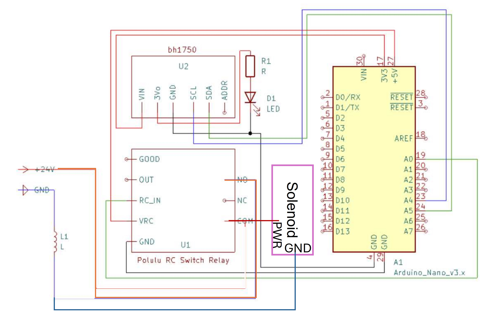

Reload Mechanism
=====

!!! note

    This page is a work in progress.

> Below are the instructions to add an automatic reload mechanism to the CyberRunner robot. The reload mechanism uses a light sensor to detect when the marble is ready to be reset to the beginning. A solenoid then launches the ball through a tube path back to the start.

## List of Purchased Components
* 1x <a href="https://www.adafruit.com/product/413" target="_blank">Adafruit Large Push-Pull Solenoid</a> 
* 1x <a href="https://store.arduino.cc/products/arduino-nano" target="_blank">Arduino Nano</a>
* 1x <a href="https://www.adafruit.com/product/4681" target="_blank"> Adafruit BH1750 Light Sensor</a>
* 1x <a href="https://www.pololu.com/product/2804" target="_blank">Polulu RC Relay Switch</a>
* 1x <a href="https://www.galaxus.ch/en/s14/product/lumina-swiss-power-supply-dc24v-3a-lighting-accessories-21674974?utm_campaign=organicshopping&utm_source=google&utm_medium=organic&utm_content=7298552&supplier=7298552" target="_blank">DC 24V 3A Power Supply</a> (Example)
* 1x White LED
* 1x 330 Ohm Resistor
* <a href="https://www.adafruit.com/product/793" target="_blank">F/F Jumper Cables</a> (Example)
* 9x M3x8 bolts 
* 6x M3x12 bolts
* Heat shrink

## List of 3D-Printed Components
* 1x <a href="https://github.com/ckoethz/cyberrunner_docs_md/blob/main/assets/reload/reload_leg_output.step" target="_blank">Marble Output Leg</a> 
* 3x <a href="https://github.com/ckoethz/cyberrunner_docs_md/blob/main/assets/reload/reload_leg.step" target="_blank">Remaining Labyrinth Legs</a> 
* 1x <a href="https://github.com/ckoethz/cyberrunner_docs_md/blob/main/assets/reload/solenoid_sensor_mount.step" target="_blank">Reload Marble Tray - Part 1</a> 
* 1x <a href="https://github.com/ckoethz/cyberrunner_docs_md/blob/main/assets/reload/reload_sensor_cover_2.step" target="_blank">Sensor Cover - Part 2</a> 
* 1x <a href="https://github.com/ckoethz/cyberrunner_docs_md/blob/main/assets/reload/reload_corridor_3.step" target="_blank">Corridor after Solenoid - Part 3</a> 
* 1x <a href="https://github.com/ckoethz/cyberrunner_docs_md/blob/main/assets/reload/reload_corridor_4.step" target="_blank">Corridor - Part 4</a> 
* 1x <a href="https://github.com/ckoethz/cyberrunner_docs_md/blob/main/assets/reload/reload_corridor_5.step" target="_blank">Corridor - Part 5</a> 
* 1x <a href="https://github.com/ckoethz/cyberrunner_docs_md/blob/main/assets/reload/reload_4_5_mount_6.step" target="_blank">Corridor Mount between 4 and 5 - Part 6</a> 
* 1x <a href="https://github.com/ckoethz/cyberrunner_docs_md/blob/main/assets/reload/reload_corridor_7.step" target="_blank">Corridor - Part 7</a> 
* 1x <a href="https://github.com/ckoethz/cyberrunner_docs_md/blob/main/assets/reload/reload_corridor_8.step" target="_blank">Corridor - Part 8</a> 
* 1x <a href="https://github.com/ckoethz/cyberrunner_docs_md/blob/main/assets/reload/reload_7_8_mount_9.step" target="_blank">Corridor Mount between 7 and 8 - Part 9</a> 
* 1x <a href="https://github.com/ckoethz/cyberrunner_docs_md/blob/main/assets/reload/reload_end_holder.step" target="_blank">Corridor End Mount</a> 
* 1x <a href="https://github.com/ckoethz/cyberrunner_docs_md/blob/main/assets/reload/reload_electronics_mount.step" target="_blank">Electronics Holder</a> 

### Suggested Tools
* Allen Wrenches - (sizes)
* Soldering Iron
* Wire clippers and strippers
* Hot glue gun
* Heat gun or hair dryer
* Pliers
* Flathead

## Building the Reload Mechanism

1. Remove the marble tray. 

  

2. Install the legs on the labyrinth. Note that the leg at the marble output has a particular design to join with the reloading marble tray. The rest are interchangeable.

3. Start assembling the new marble tray which houses the LED and light sensor to detect the marble and the solenoid to launch the marble. We will first start with the light sensor and LED wiring. 
    - Solder the pins onto the light sensor so that they are on the other side of the light sensor. (WARNING: IT IS IN THE OPPOSITE DIRECTION IN THE PHOTO)
    - Solder a 330 Ohm resistor to a (shortened!) power lead of a white LED. Further solder this to a female jumper cable which will connect to obtain power from the light sensor.
    - Create a grounding cable that splits from a female jumper cable to an end to solder to the LED and another female end to connect to the light sensor. This will ensure that the LED, light sensor, and Arduino are on the same ground. Remember to shorten the LED lead before soldering the wire to it.
    - Push the light sensor into the designated spot on the reloading marble tray across from the LED. Install part 2 - the sensor cover on top and keep track of which pin is which. Plug in the power and ground pins from the LED.

  

4. Insert the LED into the designated hole in the reloading mechanism marble tray. Carefully bend the lead ends to follow the corridor such that they do not touch each other. Hot glue the components in place.<!--  -->
  

5. Use 4x M3x12 bolts to secure the solenoid to the reloading marble tray. Ensure that the piston is facing toward the interior of the marble tray so it can launch the marble.<!--  -->
  

6. Secure the reload mechanism assembly to the labyrinth with two M3x8 bolts in the lower right holes on both connection points. <!--  -->
  

7. The corridor for the marble back to the start can now be constructed.  Use the numbers 3D printed onto each part to follow along.
    - Part 3 can be press fit into the top of the reloading marble tray and secured with 1x 3Mx8 bolt on the upper left hole of the square portion of the part. This can be pressed together with Part 4. 
    - Connect corridor Parts 4 and 5 with mount Part 6. This mount is secured to the top of the labyrinth with 2x 3Mx8 bolts. 
    - Press fit together corridor parts 5 and 7. Similarly to before, connect corridor Parts 7 and 8 with mount Part 9, which is also secured to the top of the labyrinth with 2x 3Mx8 bolts. 
    - Press fit the end mount to Part 8 and bolt it to the top of the labyrinth above where the maze starts. 

  

8. Connect the cables for the light sensor, solenoid, arduino, and relay as in the wiring diagram below.

  

9. Secure the relay and arduino in the electronics housing and secure it to the labyrinth with 2x M3x12 bolts.
  

## Configuring the Electronics

1. Plug in the arduino to your PC that will run the controller. Upload <a href="https://github.com/ckoethz/cyberrunner_docs_md/blob/main/assets/main_high_low.ino" target="_blank">this script</a> to the Arduino Nano. Note that you will need the BH1750 library to run the code.

## Reloading with the CyberRunner
(This regards connections to the computer/usb hub)